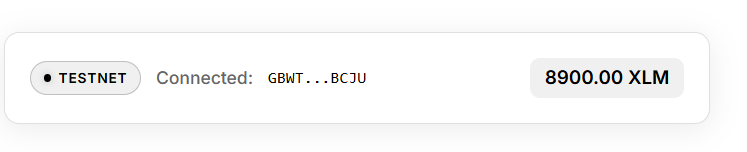
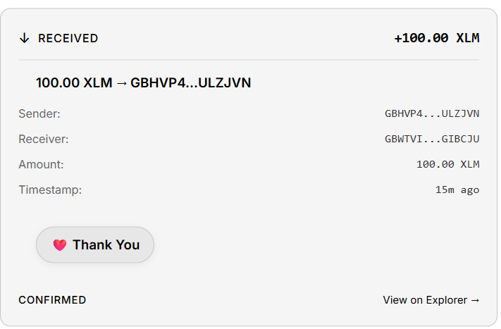

# Stellar White Belt – Payment dApp

A Stellar Testnet dApp for Level 1 (White Belt) that lets you connect a Freighter wallet, view your XLM balance, send payments, and browse on-chain transaction history with emoji reactions.

**Live demo:** [https://stellar-white.vercel.app](https://stellar-white.vercel.app/)
## Project Description

This application demonstrates the core fundamentals of Stellar development:

- Connect and disconnect a **Freighter** wallet on **Stellar Testnet**
- Fetch and display the connected wallet's **XLM balance**
- **Send XLM** payments on testnet with success/failure feedback and transaction hash
- View real-time transaction history from Stellar Horizon

All transactions are signed securely via Freighter. No private keys are ever exposed to the app.

## Level 1 Requirements Checklist

| Requirement | Status |
|---|---|
| Freighter wallet setup | ✅ |
| Stellar Testnet | ✅ |
| Wallet connect | ✅ |
| Wallet disconnect | ✅ |
| Fetch XLM balance | ✅ |
| Display balance in UI | ✅ |
| Send XLM on testnet | ✅ |
| Transaction success/failure feedback | ✅ |
| Transaction hash / confirmation | ✅ |
| Error handling | ✅ |
| Public GitHub repository | ✅ |
| README with setup instructions | ✅ |

## Tech Stack

- **Frontend:** Vanilla JavaScript + Vite
- **Blockchain:** Stellar SDK
- **Wallet:** Freighter (`@stellar/freighter-api`)
- **Network:** Stellar Testnet

## Setup Instructions (Run Locally)

### 1. Clone the repository

```bash
git clone https://github.com/abdulahaddayater/stellar-white.git
cd stellar-white/stellar-white-belt
```

### 2. Install dependencies

```bash
npm install
```

### 3. Start the development server

```bash
npm run dev
```

The app runs at [http://localhost:5173](http://localhost:5173).

### 4. Configure Freighter

1. Install the [Freighter Wallet](https://www.freighter.app/) browser extension
2. Switch the network to **TESTNET**
3. Fund your account using [Stellar Laboratory Friendbot](https://laboratory.stellar.org/#account-creator?network=test)

## App Features

1. **Wallet connected state** — Shows the connected address, Testnet badge, and active session
2. **Balance displayed** — Real-time XLM balance fetched from Stellar Testnet Horizon
3. **Send payment** — Enter a recipient address and amount, sign in Freighter, and submit on testnet
4. **Transaction result** — Success or failure message with full transaction hash and a link to Stellar Explorer

## Notes

- This is a **Testnet-only** application
- Requires the Freighter wallet browser extension
- All transactions require explicit user approval in Freighter
- No secret keys are stored or handled by the app

## Image




## Deployment

Deploy to [Vercel](https://vercel.com):

1. Import `abdulahaddayater/stellar-white` from GitHub.
2. **Root Directory:** leave as repository root (a `vercel.json` file builds `stellar-white-belt` automatically).
   - Or set Root Directory to `stellar-white-belt` in Vercel → Settings → General.
3. Deploy. Build command: `npm run build`, output: `dist`.

**Live demo:** [https://stellar-white.vercel.app](https://stellar-white.vercel.app/)
